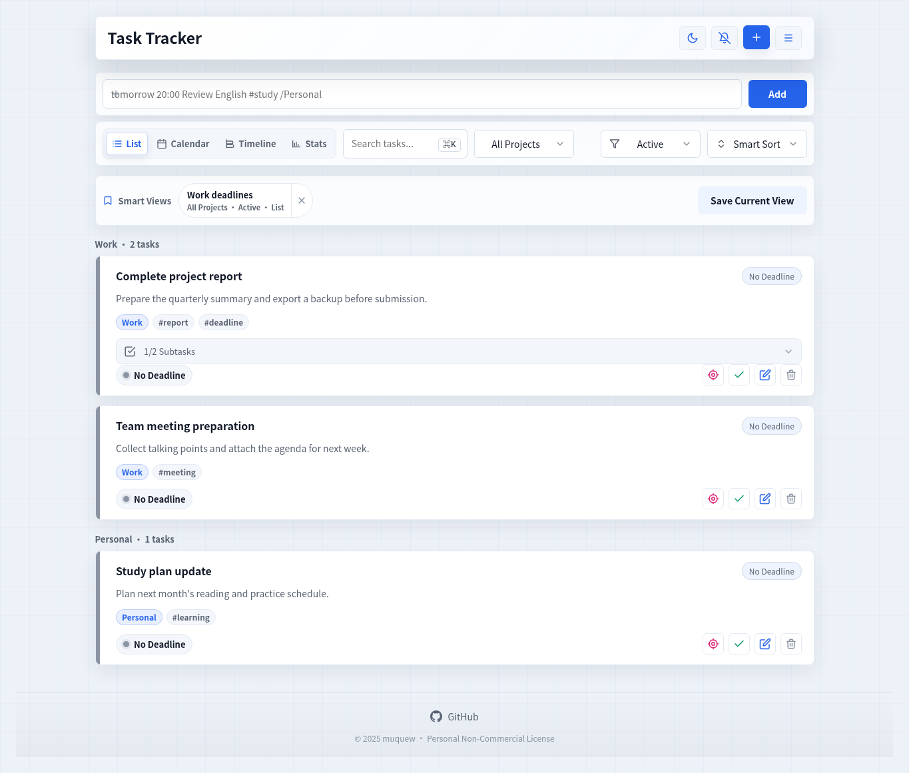
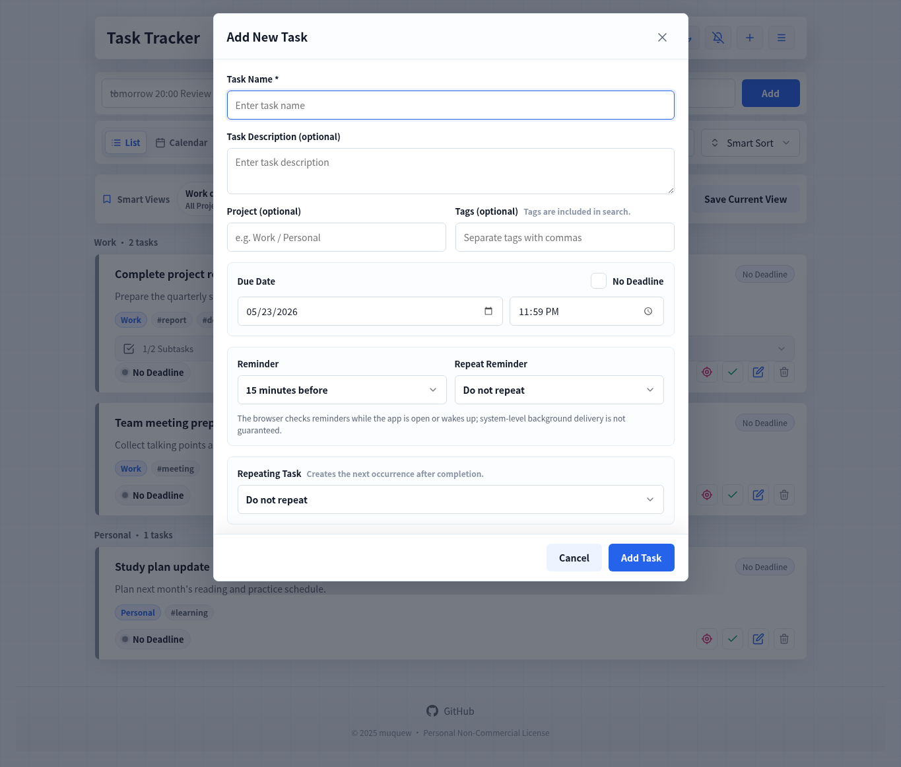

# Task Tracer

**[中文说明](./README_zh_cn.md)**

Task Tracer is a deadline-based task management PWA for personal planning, study routines, and recurring work. It keeps task data in the browser, works offline after loading, and focuses on clear deadline status, reminders, subtasks, sorting, and local backup.

[Live Demo](https://todo.muquew.com/)

## Features

- Deadline tracking: safe, warning, urgent, overdue, completed, and no-deadline states.
- Task management: add, edit, delete, complete, and restore tasks.
- Subtasks: break a task into smaller steps and track subtask progress.
- Reminders: choose no reminder, at due time, 15 minutes before, 1 hour before, or 1 day before.
- Search and filters: quickly find tasks or switch between active, completed, overdue, and no-deadline views.
- Sorting: smart sorting, newest created, due date, alphabetical order, and manual drag-and-drop order.
- Local data: IndexedDB persistence with JSON import and export.
- PWA support: app shell caching, offline loading, and installable browser experience.
- Themes and languages: light/dark themes, Simplified Chinese, and English.
- Accessibility: keyboard-friendly controls, focus management, screen-reader labels, and live status announcements.

## Screenshots

| Task List | Add Task |
| --- | --- |
|  |  |

## Usage

Use the hosted app:

```text
https://todo.muquew.com/
```

Or run it locally:

```bash
git clone https://github.com/muquew/Task-Tracer.git
cd Task-Tracer
python3 -m http.server 8080
```

Then open:

```text
http://127.0.0.1:8080/
```

## Data and Privacy

Task Tracer stores task data in the current browser's IndexedDB. It does not require an account and does not upload task content to a server by default. Before changing browsers, clearing site data, or moving devices, use Export to back up a JSON file.

## Technical Notes

- Main app: `index.html`
- Language resources: `resources/zh-CN.json`, `resources/en.json`
- PWA Service Worker: `sw.js`
- Validation: static consistency checks and Playwright browser smoke tests

## License

Task Tracer is licensed for personal non-commercial use. Personal task management, learning, research, and evaluation are allowed. Commercial use, paid distribution, or integration into commercial services requires prior written permission from `muquew`.

See [LICENSE](./LICENSE) for the full terms.
