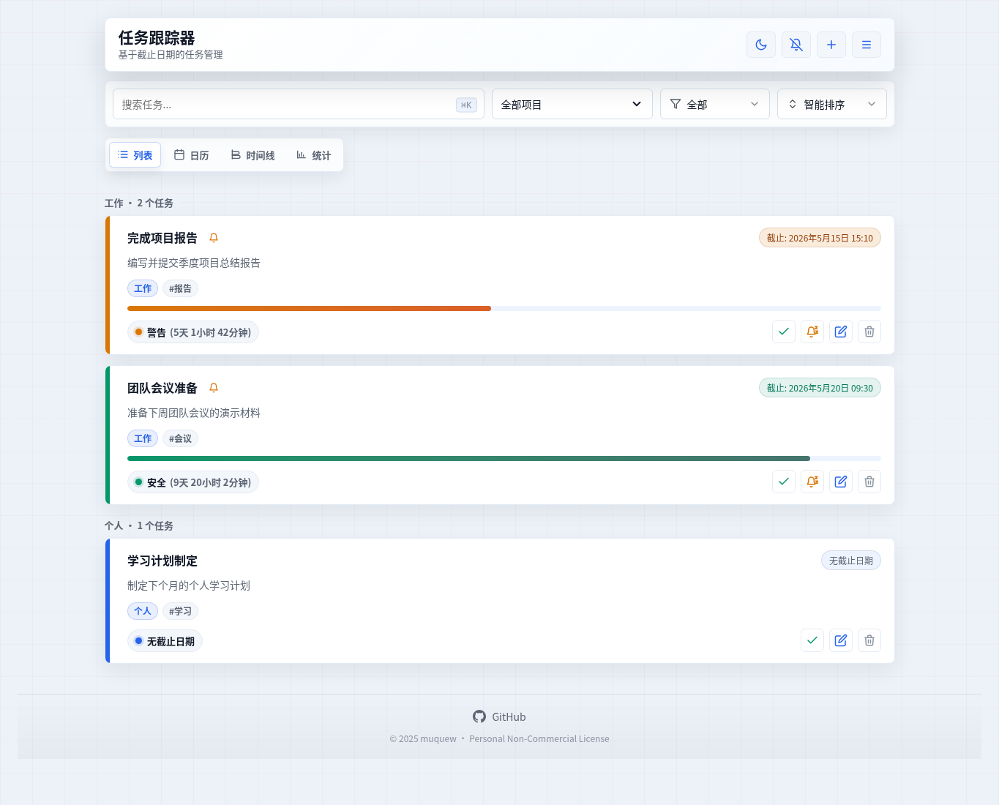
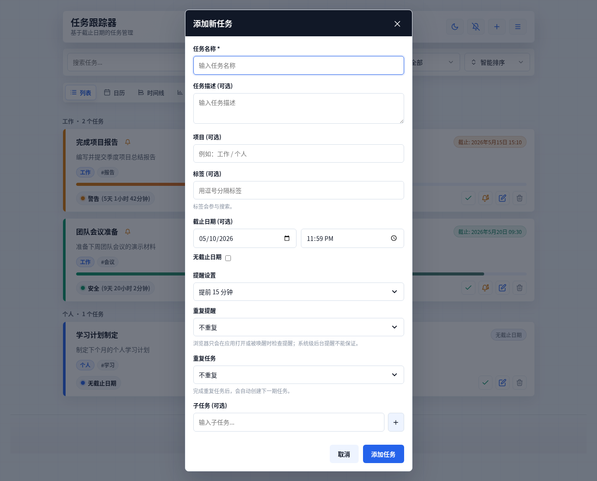

<p align="center">
  
</p>

<h1 align="center">Task Tracer 任务跟踪器</h1>

<p align="center">围绕截止日期组织的轻量 PWA 任务管理器。</p>

<p align="center">
  <a href="https://todo.muquew.com/">在线体验</a> · <a href="./README.md">English README</a>
</p>

<p align="center">
  <a href="https://todo.muquew.com/"></a>
  
  
  
  
  
</p>

Task Tracer 是一个基于截止日期的任务管理 PWA，适合个人计划、学习安排和周期性事项跟踪。它把任务数据保存在浏览器本地，加载后支持离线使用，并围绕截止日期状态、重复任务、提醒、项目分组、标签、子任务、日历查看、统计反馈、归档、导入安全和本地备份组织体验。

## 功能速览

- 截止日期跟踪：显示安全、警告、紧急、已过期、已完成、无截止日期等状态。
- 任务管理：支持新增、编辑、删除、完成、恢复、归档和从归档恢复任务。
- 重复任务：支持每天、每周、每月和自定义天数周期；完成一次后自动创建下一期。
- 子任务：把任务拆成多个步骤，单独勾选并显示进度。
- 提醒设置：可选择提醒时间、重复提醒、稍后提醒，并在应用恢复运行时提示错过的提醒。
- 项目与标签：项目作为任务的主分组，标签作为跨项目的补充标记。
- 搜索与筛选：搜索任务名称、描述、项目和标签，按进行中、已完成、已归档、已过期、无截止日期快速筛选。
- 排序方式：支持智能排序、新创建、截止日期、名称排序和手动拖拽排序。
- 日历、时间线与统计：按月份查看任务、按日期分组浏览，并展示完成率、逾期率和连续完成天数。
- 导入预览：导入前展示任务数量、同名重复项和替换影响，确认后才替换当前数据。
- 本地数据：使用 IndexedDB 持久化，支持 JSON 导入、导出和带版本说明的本地备份。
- PWA 能力：支持应用缓存、离线加载和安装到浏览器。
- 主题与语言：支持明暗主题、简体中文和英文。
- 无障碍体验：支持键盘操作、焦点管理、读屏标签和状态播报。

## 项目、标签与搜索

项目是主分组。一个任务通常属于一个项目，例如“工作”“个人”或某个具体产品。项目视图下拉可以收窄任务列表，全部项目的智能视图会按项目分组展示。

标签是补充标记。一个任务可以有多个标签，例如 `设计`、`紧急`、`复盘`。标签适合描述跨项目的共同特征。

当前搜索会匹配任务名称、任务描述、项目名称和标签。也就是说，项目不仅用于分组，也会参与搜索；标签的区别在于它可以为任务增加多个横向检索入口。

## 视图与反馈

列表视图用于日常处理任务，并保留完整任务操作。日历视图按月份展示有截止日期的任务，同时单独展示无截止日期任务。时间线视图按日期分组，适合检查一段时间内的截止安排。

统计视图按当前项目和搜索范围计算，不受进行中/已完成筛选影响。它展示完成率、进行中任务逾期率、今日完成数和基于完成时间记录的连续完成天数。

## 数据文件

- 导出：下载当前任务数据 JSON，适合迁移、查看或手动保存。
- 导入：读取 JSON 文件，先展示预览，确认后替换当前任务数据。
- 备份：下载带版本说明的本地快照，记录最近备份时间，并包含重复规则和完成时间等字段说明。

## 截图

| 任务列表 | 添加任务 |
| --- | --- |
|  |  |

## 使用方式

直接访问在线地址：

```text
https://todo.muquew.com/
```

或本地运行：

```bash
git clone https://github.com/muquew/Task-Tracer.git
cd Task-Tracer
python3 -m http.server 8080
```

然后打开：

```text
http://127.0.0.1:8080/
```

## 数据与隐私

Task Tracer 默认把任务数据保存在当前浏览器的 IndexedDB 中，不需要账号，也不会把任务内容上传到服务器。更换浏览器、清理站点数据或更换设备前，请先使用“立即备份”或“导出”下载 JSON 文件。

浏览器提醒依赖页面处于打开状态或被浏览器唤醒。Task Tracer 可以在应用重新运行后补提示错过的提醒，但不能保证所有平台都有系统级后台投递能力。

## 技术形态

- 主应用：`index.html`
- 语言资源：`resources/zh-CN.json`、`resources/en.json`
- PWA Service Worker：`sw.js`
- 部署安全响应头：`vercel.json`
- 验证：静态一致性校验与 Playwright 浏览器冒烟测试

## 许可

Task Tracer 采用个人非商业使用许可。个人任务管理、学习、研究和评估可以使用；商业使用、付费分发或集成到商业服务需要获得 `muquew` 的事先书面授权。

完整条款见 [LICENSE](./LICENSE)。
